# Relatório técnico: análise de métricas de pipeline CI/CD

Repositório: [taicortezz/ci-cd-pipeline-analysis](https://github.com/taicortezz/ci-cd-pipeline-analysis)  
Workflow: [`.github/workflows/ci.yml`](https://github.com/taicortezz/ci-cd-pipeline-analysis/blob/main/.github/workflows/ci.yml)

## 1. Introdução

Este relatório apresenta um experimento prático de análise de um pipeline CI/CD executado no GitHub Actions. O foco foi observar desempenho, estabilidade e gargalos de uma esteira simples, usando execuções reais e métricas coletadas por script.

## 2. Objetivo do experimento

O objetivo foi medir o comportamento do workflow `CI` em 12 execuções reais, aplicando variações controladas como aumento de testes, teste mais custoso, cache, paralelismo, falha controlada, recuperação da pipeline e alteração na ordem das etapas.

## 3. Projeto utilizado

O projeto utilizado foi uma API simples de gerenciamento de tarefas, desenvolvida com Python 3.12, FastAPI, Pytest e Flake8. A API permite criar, listar, buscar, concluir e remover tarefas, além de consultar estatísticas gerais sobre tarefas pendentes e concluídas.

Endpoints principais:

- `POST /tasks`
- `GET /tasks`
- `GET /tasks/{task_id}`
- `PATCH /tasks/{task_id}/complete`
- `DELETE /tasks/{task_id}`
- `GET /tasks/stats`

## 4. Estrutura do pipeline

O workflow `CI` foi executado em `push` e `pull_request`. Ao longo do experimento, sua estrutura mudou conforme a variação testada. As etapas principais foram:

- checkout do repositório;
- configuração do Python 3.12;
- instalação das dependências via `requirements.txt`;
- execução do lint com Flake8;
- execução dos testes com Pytest;
- geração do `test-results.xml`;
- geração do `test-summary.json`;
- upload do artefato `test-results`.

Em algumas execuções, o pipeline teve um único job `ci`. Em outras, foi dividido em jobs paralelos, como `lint`, `tests` e `quality`.

## 5. Metodologia de coleta

As execuções foram registradas manualmente em [`reports/experiment-log.md`](reports/experiment-log.md), com run, commit, status, duração, quantidade de testes, falhas, artefatos e variação aplicada.

A coleta automatizada foi feita pelo script [`scripts/collect_metrics.py`](scripts/collect_metrics.py), que consulta a API REST do GitHub Actions para buscar runs, jobs e artefatos. O script gera:

- [`metrics/pipeline-runs.csv`](metrics/pipeline-runs.csv)
- [`metrics/pipeline-runs.json`](metrics/pipeline-runs.json)

O arquivo `metrics/pipeline-runs.csv` possui uma linha por job executado. Por isso, embora o experimento tenha 12 execuções reais, a base contém 17 linhas, já que algumas execuções tiveram jobs paralelos, como `lint`, `tests` e `quality`.

Os gráficos foram gerados por [`scripts/generate_charts.py`](scripts/generate_charts.py), a partir do CSV coletado.

## 6. Execuções realizadas

**Execução 1 - baseline inicial**  
Run ID `27016416826`, run [`#1`](https://github.com/taicortezz/ci-cd-pipeline-analysis/actions/runs/27016416826), commit `1a38570`. A primeira execução serviu como linha de base do experimento. O pipeline ainda era simples, com um único job `ci`, `30` testes e nenhuma falha. O tempo total de `15s` foi usado como referência inicial para comparar as mudanças seguintes.

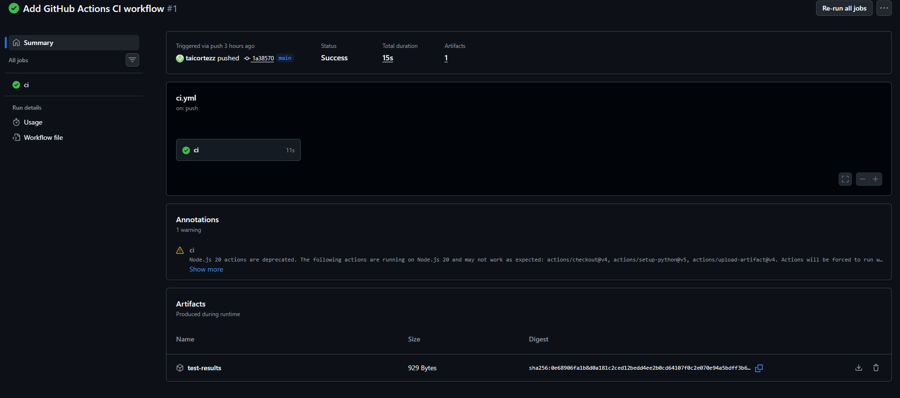

**Execução 2 - repetição baseline**  
Run ID `27017568745`, run [`#2`](https://github.com/taicortezz/ci-cd-pipeline-analysis/actions/runs/27017568745), commit `c9b3307`. A segunda execução repetiu a baseline sem mudanças funcionais. O tempo total caiu levemente para `14s`, mantendo `30` testes e `0` falhas. Essa repetição ajudou a observar a variação natural do GitHub Actions antes de introduzir alterações controladas.

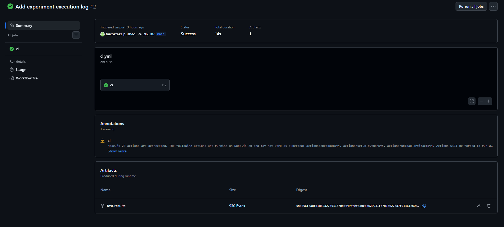

**Execução 3 - aumento da quantidade de testes**  
Run ID `27018027947`, run [`#3`](https://github.com/taicortezz/ci-cd-pipeline-analysis/actions/runs/27018027947), commit `11ddfc1`. A quantidade de testes foi ampliada de `30` para `47`, mas a duração total permaneceu em `15s`. O resultado mostrou que aumentar o número de testes não necessariamente aumenta o tempo do pipeline quando os testes adicionados são leves.

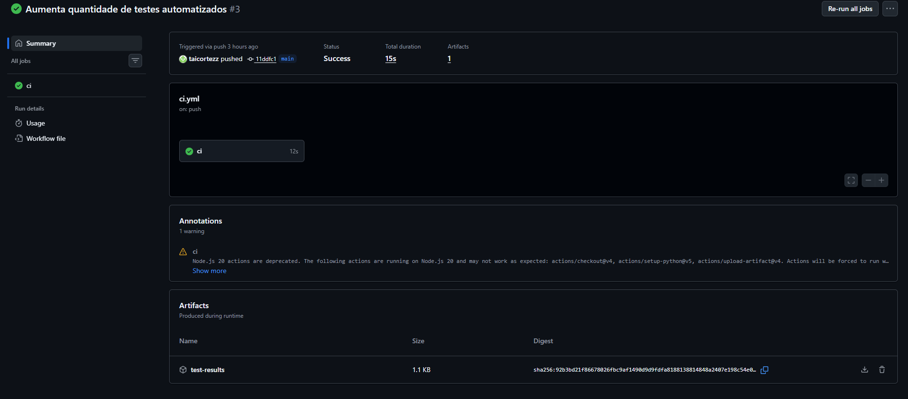

**Execução 4 - introdução de teste mais custoso**  
Run ID `27020234383`, run [`#4`](https://github.com/taicortezz/ci-cd-pipeline-analysis/actions/runs/27020234383), commit `5c6fd5f`. Foi adicionado um teste mais custoso, simulando operações em massa com tarefas. A quantidade subiu para `48` testes e o tempo total aumentou para `18s`. Essa execução evidenciou que o custo individual dos testes impacta mais o pipeline do que a quantidade absoluta de casos.

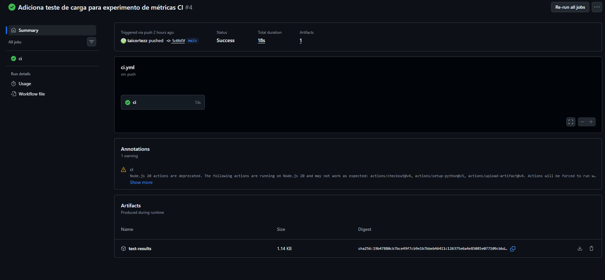

**Execução 5 - cache de dependências**  
Run ID `27020772806`, run [`#5`](https://github.com/taicortezz/ci-cd-pipeline-analysis/actions/runs/27020772806), commit `7a8938f`. Foi adicionado cache de dependências `pip`. A execução ficou em `17s`, com `48` testes e sem falhas. Como a redução em relação à execução anterior foi pequena, o resultado indicou que a instalação de dependências não era o principal gargalo do projeto.

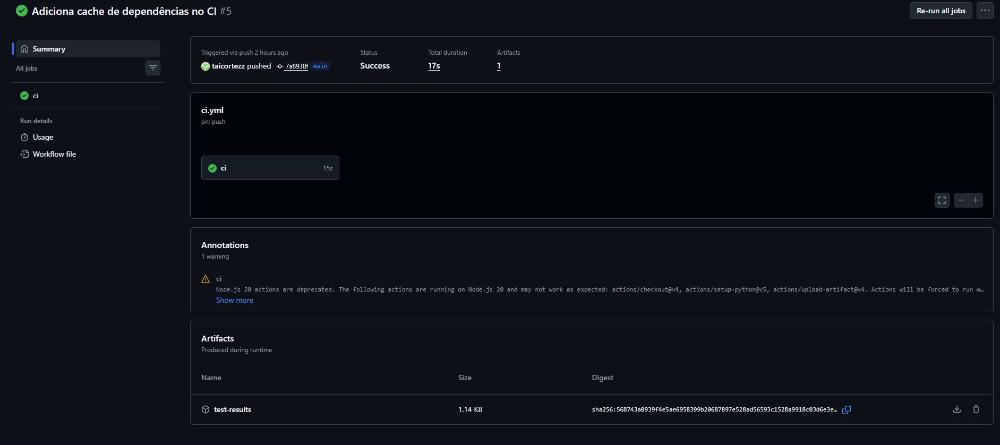

**Execução 6 - cache aquecido**  
Run ID `27021487762`, run [`#6`](https://github.com/taicortezz/ci-cd-pipeline-analysis/actions/runs/27021487762), commit `a346354`. Esta execução avaliou o cache já aquecido, sem mudança relevante no código. Mesmo assim, o tempo total foi `19s`, maior que na execução anterior. Isso reforçou que o cache funcionou como variação técnica, mas não gerou ganho significativo neste projeto pequeno.

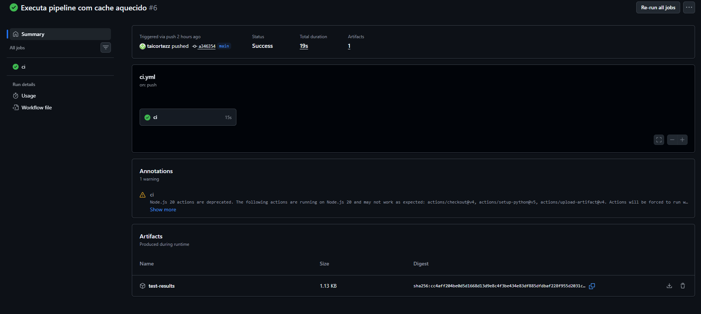

**Execução 7 - jobs paralelos**  
Run ID `27022190030`, run [`#7`](https://github.com/taicortezz/ci-cd-pipeline-analysis/actions/runs/27022190030), commit `4fb5737`. O pipeline foi dividido em dois jobs independentes: `lint` e `tests`. Apesar da execução paralela, o tempo total foi `21s`, com `lint = 11s` e `tests = 16s`. O resultado mostrou que o paralelismo não trouxe ganho claro, possivelmente por overhead de múltiplos runners.

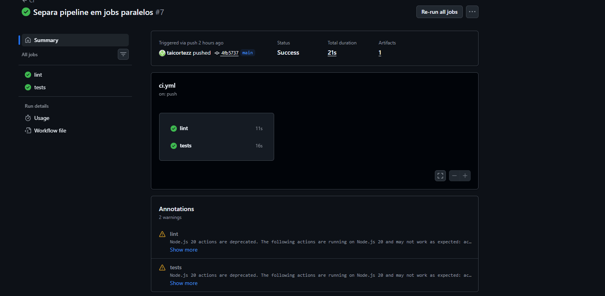

**Execução 8 - falha controlada**  
Run ID `27023109897`, run [`#8`](https://github.com/taicortezz/ci-cd-pipeline-analysis/actions/runs/27023109897), commit `4af8797`. Foi introduzida uma falha intencional em um teste automatizado. A execução terminou como `Failure`, com `49` testes e `1` falha. O job `lint` continuou verde, enquanto `tests` falhou, demonstrando que a pipeline isola corretamente o ponto de falha e ainda permite observar os artefatos do processo.

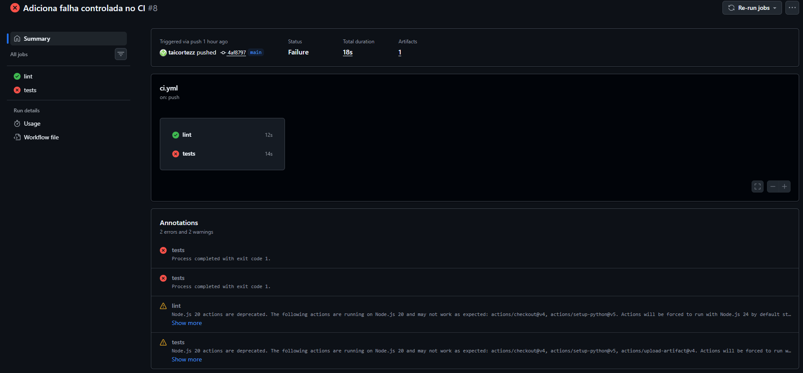

**Execução 9 - recuperação da pipeline**  
Run ID `27023587040`, run [`#9`](https://github.com/taicortezz/ci-cd-pipeline-analysis/actions/runs/27023587040), commit `0033da0`. A falha controlada foi removida e a suíte voltou ao estado saudável. A execução retornou para `Success`, com `48` testes e `0` falhas. Esse resultado confirmou a recuperação da pipeline e permitiu comparar diretamente o comportamento antes e depois da quebra.

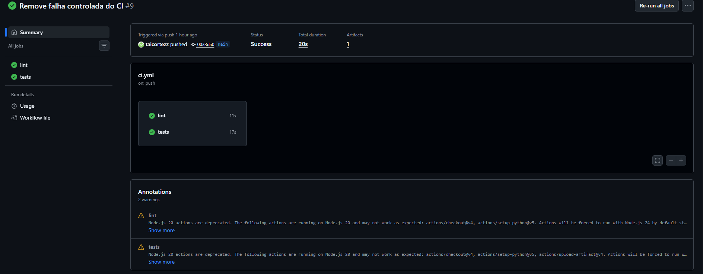

**Execução 10 - retorno ao job sequencial**  
Run ID `27024270507`, run [`#10`](https://github.com/taicortezz/ci-cd-pipeline-analysis/actions/runs/27024270507), commit `c926f1f`. O workflow voltou para um único job sequencial `ci`. O tempo total foi `22s`, com job principal de `18s`. A comparação com a execução paralela mostrou que, neste contexto, a estrutura dos jobs teve menos impacto que o custo total de setup e testes.

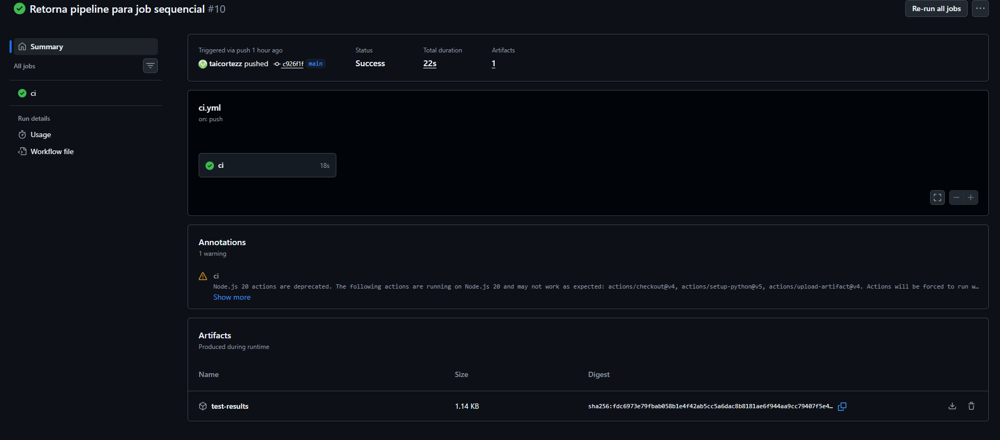

**Execução 11 - alteração da ordem das etapas**  
Run ID `27024470040`, run [`#11`](https://github.com/taicortezz/ci-cd-pipeline-analysis/actions/runs/27024470040), commit `bd749b3`. A ordem das etapas foi invertida para executar testes antes do lint. O tempo total permaneceu em `22s`, sem falhas. A mudança não melhorou o desempenho, mas mostrou que a ordem das validações pode ser alterada para priorizar diferentes tipos de feedback ao desenvolvedor.

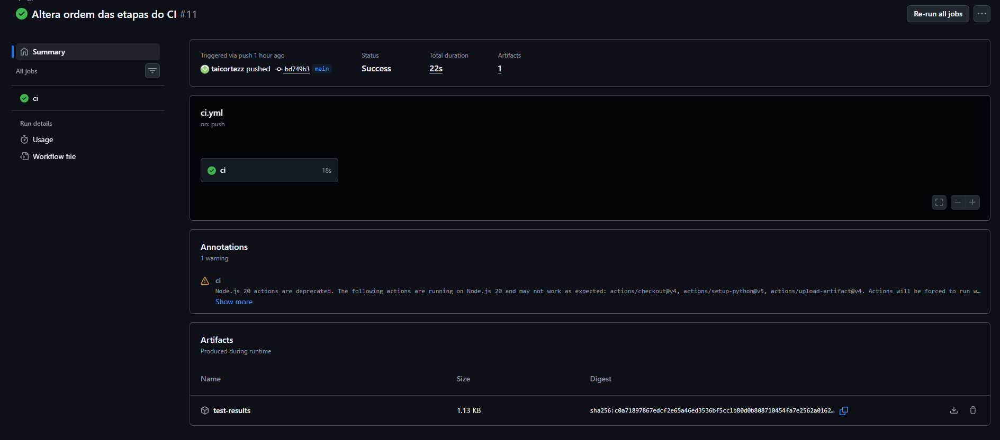

**Execução 12 - adição do job quality**  
Run ID `27024969460`, run [`#12`](https://github.com/taicortezz/ci-cd-pipeline-analysis/actions/runs/27024969460), commit `fcd647c`. Foi adicionado um terceiro job paralelo, `quality`, executando uma verificação simples de coleta dos testes. A execução terminou em `21s`, com `lint = 11s`, `tests = 18s` e `quality = 10s`. Mesmo com mais um job, o tempo total continuou dominado pelo job `tests`.

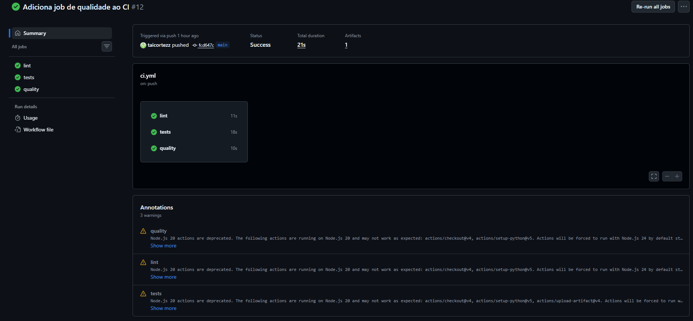

## 7. Gráficos e análise dos resultados

### Tempo total por execução

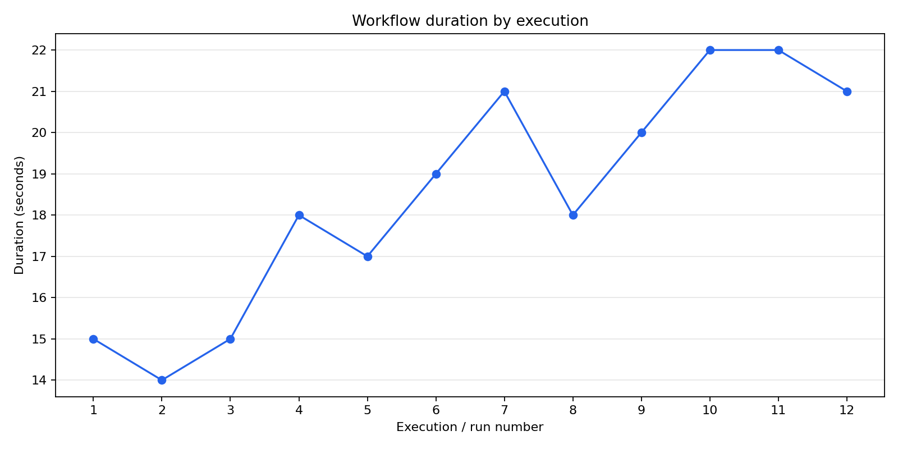

O tempo total variou de `14s` a `22s`. As execuções baseline ficaram entre `14s` e `15s`. A introdução do teste mais custoso elevou a duração para `18s`. As execuções posteriores, com cache, paralelismo e mudanças estruturais, ficaram entre `17s` e `22s`.

O gráfico mostra que a pipeline tinha um custo mínimo de execução mesmo quando os testes eram leves. Esse custo aparece nas execuções 1, 2 e 3, que ficaram próximas apesar da mudança de `30` para `47` testes. A partir da execução 4, o teste mais custoso elevou o patamar de tempo da esteira. Isso sugere que o tempo total não depende apenas da quantidade de testes, mas também do custo de cada teste e do overhead fixo do GitHub Actions, como checkout, setup do Python, instalação de dependências e upload de artefatos.

Também é possível observar que as alterações estruturais não produziram uma redução clara. A execução 7, com jobs paralelos, chegou a `21s`; as execuções 10 e 11, com job sequencial, ficaram em `22s`; e a execução 12, com três jobs paralelos, ficou em `21s`. Portanto, para este projeto pequeno, o paralelismo não trouxe ganho relevante no tempo total.

### Tempo por job

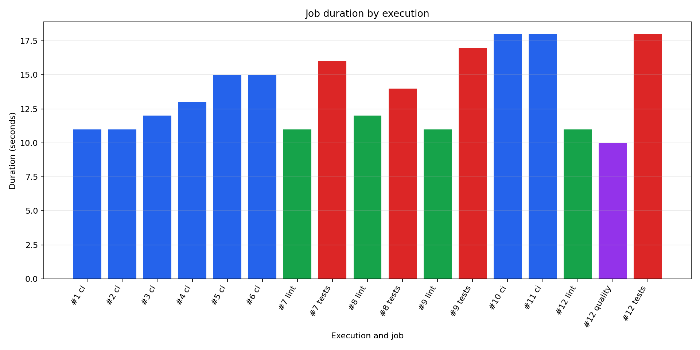

O job `ci` nas execuções sequenciais variou entre `11s` e `18s`. Nas execuções paralelas, o job `tests` foi o mais relevante, chegando a `18s` na execução 12. O job `quality`, criado apenas para coleta de testes, teve `10s`.

Esse gráfico ajuda a identificar onde o tempo se concentra. Nas execuções sequenciais, o job `ci` reúne todas as etapas, então seu tempo inclui instalação de dependências, lint, testes, geração de arquivos e upload de artefato. Por isso ele cresce conforme o pipeline fica mais complexo. Nas execuções paralelas, a separação permite observar melhor cada responsabilidade: `lint` ficou entre `11s` e `12s`, enquanto `tests` variou entre `14s` e `18s`.

O principal gargalo observado foi o job `tests`. Mesmo quando `lint` e `quality` executam em paralelo, o tempo total do workflow tende a ser limitado pelo job mais demorado. Na execução 12, por exemplo, `quality` levou `10s`, `lint` levou `11s`, mas `tests` levou `18s`; por isso o tempo total permaneceu em `21s`. Isso indica que otimizar testes ou separar grupos de testes poderia gerar mais impacto do que apenas adicionar novos jobs paralelos.

### Taxa de sucesso e falha

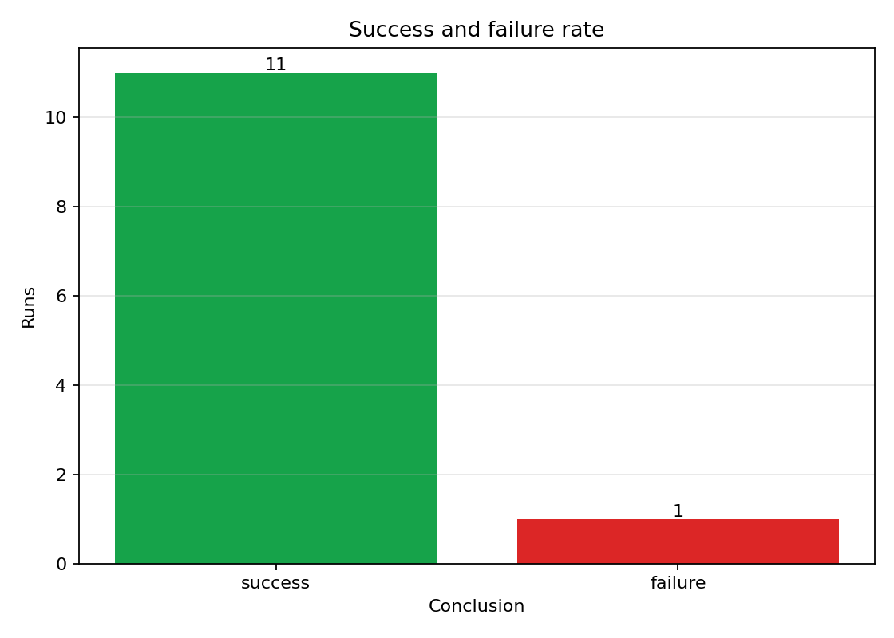

Das 12 execuções, 11 terminaram com sucesso e 1 falhou. A falha foi intencional na execução 8, usada para medir o comportamento da pipeline em um cenário quebrado.

A taxa de falha foi baixa e controlada. Isso é importante porque mostra que as variações de desempenho analisadas não foram causadas por instabilidade aleatória da aplicação ou do workflow. A única falha ocorreu quando um teste foi propositalmente quebrado, e o comportamento foi o esperado: o job `lint` continuou verde, enquanto o job `tests` falhou.

Esse resultado também mostra que o pipeline consegue diferenciar problemas de qualidade estática e problemas de teste automatizado. Para uma equipe de desenvolvimento, isso é útil porque reduz ambiguidade na investigação: uma falha no job `tests` direciona a análise para comportamento da aplicação ou suíte de testes, enquanto uma falha no `lint` apontaria para padrão de código.

### Quantidade de testes x duração

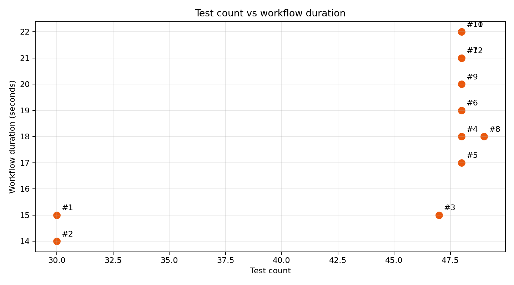

A execução 3 aumentou a quantidade de testes de `30` para `47`, mas o tempo total ficou em `15s`, praticamente igual ao baseline. Já a execução 4, com `48` testes e um teste mais custoso, subiu para `18s`. Isso indica que o custo dos testes importa mais que a quantidade absoluta.

O gráfico reforça uma conclusão importante: quantidade de testes e duração do pipeline não cresceram de forma linear. As execuções com `48` testes aparecem com durações diferentes, variando de `17s` a `22s`, dependendo da configuração do pipeline. Isso mostra que fatores como estrutura dos jobs, cache, ordem das etapas e overhead de execução também influenciam o tempo total.

O ponto mais relevante é a comparação entre as execuções 3 e 4. A execução 3 tinha `47` testes e durou `15s`; a execução 4 tinha apenas um teste a mais, mas durou `18s`. Como a diferença foi causada por um teste mais custoso, o experimento evidencia que nem todos os testes têm o mesmo peso. Para decisões de engenharia, isso sugere que acompanhar tempo médio e tempo por teste pode ser mais útil do que olhar somente a contagem total de testes.

## 8. Respostas às perguntas de análise

**Qual etapa mais contribuiu para o tempo total do pipeline?**  
Nas execuções com jobs separados, o job `tests` foi o principal componente de tempo, com `16s`, `14s`, `17s` e `18s`. Nas execuções sequenciais, o job `ci` inteiro domina porque concentra instalação, lint, testes e artefatos.

**Houve diferença significativa entre execuções com e sem cache?**  
Não. A execução 5 com cache levou `17s` e a execução 6 com cache aquecido levou `19s`. O cache funcionou como variação técnica, mas não reduziu significativamente o tempo neste projeto pequeno.

**O paralelismo reduziu o tempo total? Em que condições?**  
Não reduziu neste experimento. A execução 7 com `lint` e `tests` paralelos levou `21s`, enquanto execuções sequenciais próximas ficaram entre `17s` e `22s`. O overhead de runners separados, checkout, setup e instalação limitou o ganho.

**Quais falhas foram mais frequentes?**  
Houve apenas uma falha, na execução 8, causada por um teste intencionalmente falho. Não houve falhas recorrentes ou instabilidade espontânea.

**O pipeline fornece feedback rápido o suficiente?**  
Sim, para este projeto. Todas as execuções ficaram abaixo de `25s`, o que fornece feedback rápido para o desenvolvedor.

**Que melhorias poderiam ser feitas no pipeline?**  
Para um projeto maior, seria útil separar melhor testes unitários e integração, coletar métricas de etapas individuais com mais detalhe, manter cache, e publicar relatórios de teste mais ricos.

**Quais limitações existem nos dados coletados?**  
O projeto é pequeno, as execuções foram poucas, o ambiente do GitHub Actions varia naturalmente e algumas mudanças medem mais overhead do workflow do que desempenho real da aplicação.

**Como essa análise poderia apoiar decisões de engenharia?**  
Ela ajuda a decidir se cache, paralelismo e reorganização de jobs realmente melhoram a esteira. Neste caso, mostrou que otimizar testes custosos e reduzir overhead pode ser mais importante que paralelizar cedo.

## 9. Resultados inesperados

O primeiro resultado inesperado foi a execução 3: aumentar de `30` para `47` testes quase não alterou a duração total, que ficou em `15s`. A hipótese inicial era que mais testes aumentariam claramente o tempo, mas os testes adicionados eram leves.

O segundo resultado inesperado foi o cache. A hipótese era que o cache reduziria a duração após aquecido, mas as execuções 5 e 6 ficaram em `17s` e `19s`. Isso sugere que a instalação de dependências não era o gargalo principal.

Outro resultado relevante foi o paralelismo. A expectativa era reduzir o tempo total, mas a execução 7 levou `21s`. Em um projeto pequeno, o custo de iniciar jobs separados foi maior que o ganho de executar lint e testes em paralelo.

## 10. Limitações do experimento

- Foram analisadas apenas 12 execuções.
- O projeto é pequeno e não representa sistemas com muitos módulos ou testes longos.
- O tempo do GitHub Actions pode variar por fatores externos.
- Algumas métricas dependem dos artefatos gerados pelo workflow.
- O paralelismo foi testado em poucas configurações.
- O cache foi avaliado com poucas dependências, reduzindo a chance de ganho perceptível.

## 11. Como reproduzir o experimento

Instalar dependências:

```bash
python -m venv .venv
.venv\Scripts\activate
pip install -r requirements.txt
```

Executar API:

```bash
uvicorn app.main:app --reload
```

Executar testes e lint:

```bash
pytest tests
flake8 --jobs 1 app tests
```

Coletar métricas do GitHub Actions:

```powershell
$env:GITHUB_TOKEN="seu_token_aqui"
python scripts\collect_metrics.py
```

Gerar gráficos:

```bash
python scripts/generate_charts.py
```

Os arquivos gerados ficam em:

- `metrics/pipeline-runs.csv`
- `metrics/pipeline-runs.json`
- `graphs/workflow-duration.png`
- `graphs/job-duration.png`
- `graphs/success-failure.png`
- `graphs/tests-vs-duration.png`

## 12. Conclusão

O experimento cumpriu o objetivo de medir uma pipeline CI/CD real usando GitHub Actions. A análise mostrou que a quantidade de testes, isoladamente, não explicou a duração do pipeline; o custo dos testes e o overhead da estrutura do workflow foram mais relevantes. Cache e paralelismo não trouxeram ganhos claros neste projeto pequeno. A falha controlada e a recuperação demonstraram que a pipeline identifica problemas e volta ao estado saudável após a correção. Portanto, a esteira fornece feedback rápido e dados suficientes para apoiar decisões técnicas sobre organização, testes e evolução do CI/CD.
